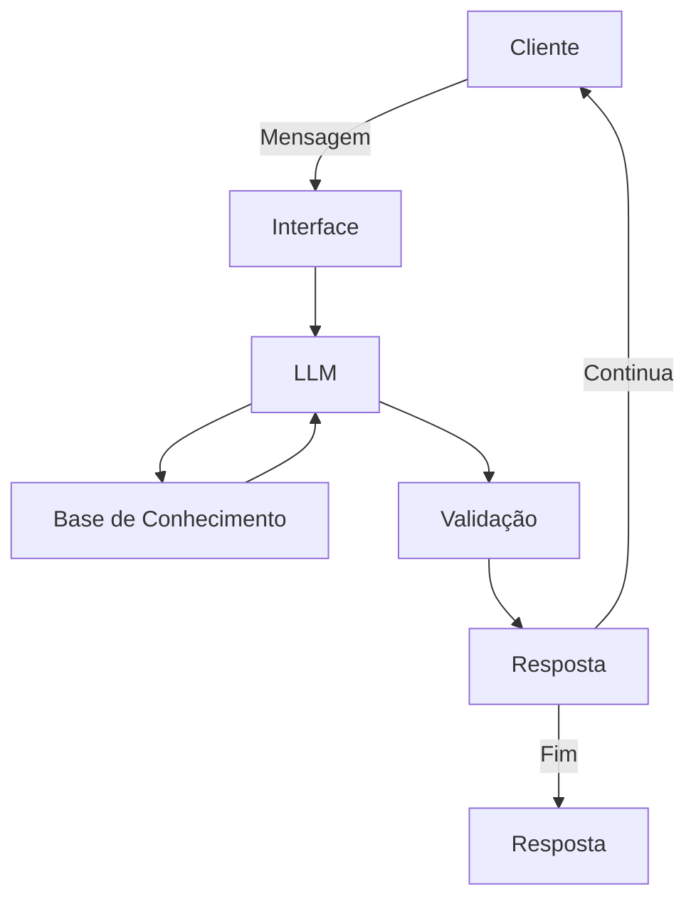

# 🤖 AJUDA-aí - Agente Inteligente de Consultoria Financeira

## 📋 Sobre o Projeto

**AJUDA-aí** é um agente de IA generativa desenvolvido para oferecer consultoria financeira personalizada e inteligente. O projeto foi criado como parte do Bootcamp Bradesco/DIO, representando uma evolução de chatbots reativos para assistentes proativos que antecipam necessidades financeiras dos usuários com o investimento de renda fixa CDB.

---

## Arquitetura

### Diagrama



### 🎯 Objetivos

- **Antecipar necessidades** financeiras ao de apenas responder perguntas!
- **Personalizar** sugestões baseadas no perfil e histórico do cliente
- **Cocriar soluções** financeiras de forma consultiva
- **Garantir segurança** e confiabilidade nas respostas (anti-alucinação)

## 🏗️ Estrutura do Projeto

```
📁 dio-lab-bia-do-financeiro/
│
├── 📄 README.md                      # Documentação principal
│
├── 📁 data/                          # Dados mockados para o agente
│   ├── projeto3.py                   # codigo de análise de perfil
│   ├── perfil_investidor.py          # Perfil do cliente
│   ├── produtos_financeiros.py       # Produtos disponíveis
│   └── transacoes.csv                # Histórico de transações
│
├── 📁 docs/                          # Documentação detalhada
│   ├── 01-documentacao-agente.md     # Caso de uso e arquitetura
│   ├── 02-base-conhecimento.md       # Estratégia de dados
│   ├── 03-prompts.md                 # Engenharia de prompts
│   ├── 04-metricas.md                # Avaliação e métricas
│   └── 05-pitch.md                   # Roteiro do pitch
│
├── 📁 src/                           # Código da aplicação
│   └── app.py                        # Aplicação principal
│
├── 📁 assets/                        # Recursos visuais
│   └── ...
│
└── 📁 examples/                      # Exemplos e referências
    └── README.md
```

## 🚀 Funcionalidades Principais

### 1. Análise de Perfil de Investidor
- Avaliação personalizada do perfil de risco
- Recomendações de produtos adequados ao perfil
- Análise de objetivos financeiros de curto, médio e longo prazo

### 2. Gestão de Transações
- Monitoramento de histórico de transações
- Identificação de padrões de gastos
- Alertas proativos sobre gastos incomuns

### 3. Consultoria Personalizada
- Sugestões de produtos financeiros adequados
- Orientações sobre investimentos e economia

### 4. Segurança e Confiabilidade
- Sistema anti-alucinação para respostas precisas
- Validação de dados contra base de conhecimento
- Respostas baseadas em informações verificadas

## 🛠️ Tecnologias Utilizadas

| Categoria | Tecnologias |
|-----------|------------|
| **Linguagem** | Python 3.8+ |
| **IA/LLM** | Gemini |
| **Interface** | Streamlit |
| **Dados** | Pandas, CSV, python |

## 📦 Instalação

### Pré-requisitos
- Python 3.8 ou superior
- pip (gerenciador de pacotes Python)

### Passos

1. Clone o repositório:
```bash
git clone https://github.com/vini1alves/dio-lab-bia-do-financeiro-/tree/main
```

2. Instale as dependências:
```bash
## Exemplo de requirements.txt

streamlit
google.generativeai
pandas
```

3. Configure as variáveis de ambiente:
```bash
src/
├── app.py 
# Edite o arquivo app.py com suas credenciais de API
```

## 🎮 Como Usar

### Executando a Aplicação

```bash
# Acesse a pasta src
src/
├── app.py 

# Execute a aplicação
python: streamlit run DIO/app.py
```

A aplicação estará disponível em http://localhost:8501 pelo streamlit 

### Exemplos de Interação

```
Usuário: "Oi Bia, como posso economizar mais este mês?"
AJUDA-aí: "Com base no seu histórico, identifiquei que você gasta em média R$ 450 
      em alimentação fora de casa. Que tal estabelecer uma meta de reduzir 
      isso para R$ 300? Preparei algumas dicas personalizadas para você..."

Usuário: "Qual investimento você recomenda para mim?"
AJUDA-aí: "Considerando seu perfil moderado, a necessidade de liquidez para a reserva de emergência e o prazo relativamente curto para completá-la, minha recomendação principal é o CDB Liquidez Diária."
```

## 📊 Base de Conhecimento

O agente utiliza dados mockados localizados na pasta [`/data`](/data):

- **transacoes.csv**: Histórico financeiro do cliente
- **perfil_investidor.py**: Perfil de risco e preferências
- **produtos_financeiros.py**: Catálogo de produtos disponíveis
- **projeto3.py**: Lógica de atendimentos e interações

## 🎯 Casos de Uso

1. **Planejamento Financeiro**: Auxílio na criação de metas e orçamentos
2. **Consultoria de Investimentos**: Recomendações personalizadas de produtos
3. **Análise de Gastos**: Identificação de padrões e oportunidades de economia
4. **Educação Financeira**: Orientações sobre conceitos financeiros

## 📈 Métricas e Avaliação

O projeto implementa métricas para avaliar:

- **Precisão das respostas**: Conformidade com a base de conhecimento
- **Taxa de segurança**: Ausência de alucinações
- **Personalização**: Adequação ao perfil do usuário
- **Satisfação do usuário**: Feedback e iterações

Veja mais detalhes em [`docs/04-metricas.md`](docs/04-metricas.md)

## 🎬 Demonstração

Assista ao pitch do projeto: [Link para o vídeo](docs/05-pitch.md)

## 🤝 Contribuindo

Contribuições são bem-vindas! Para contribuir:

1. Faça um Fork do projeto
2. Crie uma branch para sua feature (`git checkout -b feature/MinhaFeature`)
3. Commit suas mudanças (`git commit -m 'Adiciona MinhaFeature'`)
4. Push para a branch (`git push origin feature/MinhaFeature`)
5. Abra um Pull Request

## 👤 Autor

**Vinícius Alves**

- GitHub: [@vini1alves](https://github.com/vini1alves)
- LinkedIn: [@Vinícius Alves](https://www.linkedin.com/in/vinicius-alves-aa1651171/)

## 🙏 Agradecimentos

- **DIO (Digital Innovation One)** - Pela estrutura do bootcamp
- **Bradesco** - Pelo patrocínio e oportunidade
- **Comunidade Open Source** - Pelas ferramentas e bibliotecas utilizadas

## 📚 Recursos Adicionais

- [Documentação Completa](docs/)
- [Exemplos de Código](data/)
- [API Reference](https://github.com/googleapis/python-genai))

---

**Desenvolvido com ❤️ durante o Bootcamp Bradesco/DIO**

*Projeto em desenvolvimento ativo - última atualização: Janeiro 2026*
