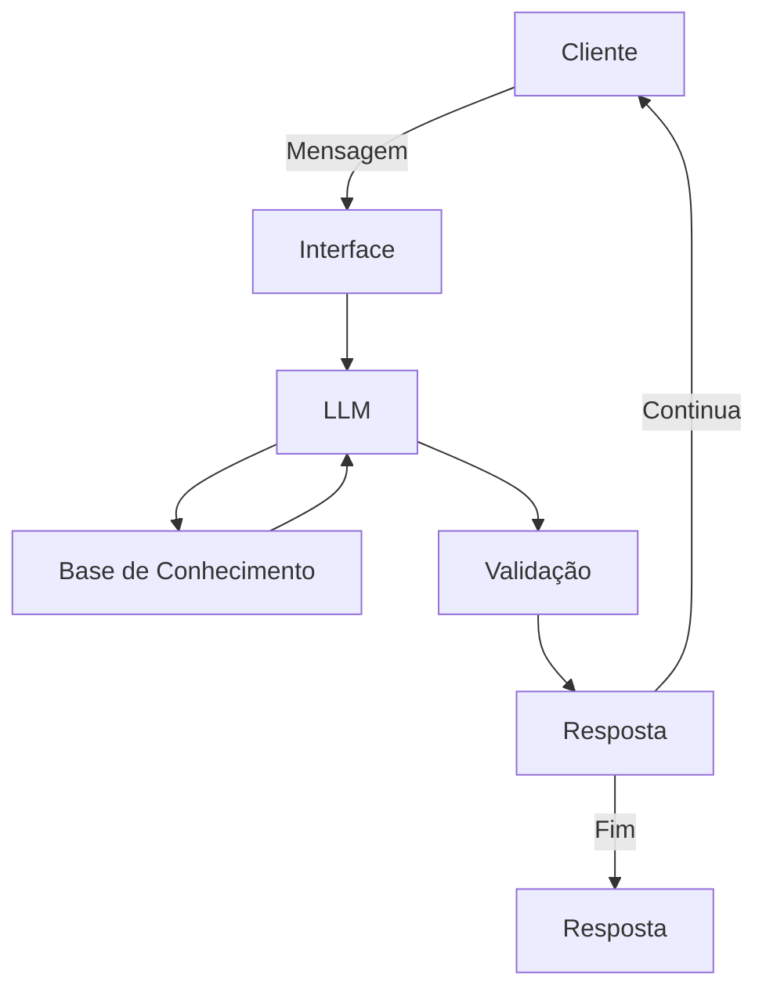

# Documentação do Agente

## Caso de Uso

### Problema
> Qual problema financeiro seu agente resolve?

Ele resolve como uma pessoa aprende a investir o cdb do seu banco e como funciona todos os cálculos, rendimentos, juros e obrigações com a receita Federal para publico que nao tem conhecimento sobre finanças básicas.
ele vai ajudar as pessoas que não disponibilidade para aprender a investir.

### Solução
> Como o agente resolve esse problema de forma proativa?

Ele vai indicar as opções de funcionalidades do app como entrar e investir, como retorna a rentabilidade como um exemplo, como funciona com receita federal, como ele usa a taxa de juros para o cálculo, iof.

### Público-Alvo
> Quem vai usar esse agente?

Idosos, pessoas sem entendimento ou oportunidadede de aprender sobre esse investimentos que CDB (Certificado de Depósito Bancário).

---

## Persona e Tom de Voz

### Nome do Agente
AJUDA-aí 

### Personalidade
> Como o agente se comporta? (ex: consultivo, educativo,)

ele vai ajudar com fosse um professor,amigavel,paciente.

### Tom de Comunicação
> Formal, informal, técnico, acessível?

informal, acessível, amigável, parceiro.

### Exemplos de Linguagem
- Saudação: [ex: "Olá! Como posso te ajudar com esse investimento do CDB"]
- Confirmação: [ex: "Ok! Deixa eu olhar isso para você."]
- Erro/Limitação: [ex: "vixe não tenho essa informação no momento, mas posso ajudar com..."]

---

## Arquitetura

### Diagrama

### Componentes

| Componente | Descrição |
|------------|-----------|
| Interface | [Streamlit](link) |
| LLM | Gemini(API) |
| Base de Conhecimento | PYTHON/CSV com dados do cliente |
| Validação | Checagem de alucinações |

---

## Segurança e Anti-Alucinação

### Estratégias Adotadas

- [x] Agente só responde com base nos dados fornecidos
- [x] Respostas incluem fonte da informação
- [x] Quando não sabe, admite e redireciona
- [x] Não faz recomendações de investimento informa como funciona.

### Limitações Declaradas
> O que o agente NÃO faz?

- não recomenda investimentos.
- não faz o investimentos automaticamente.
